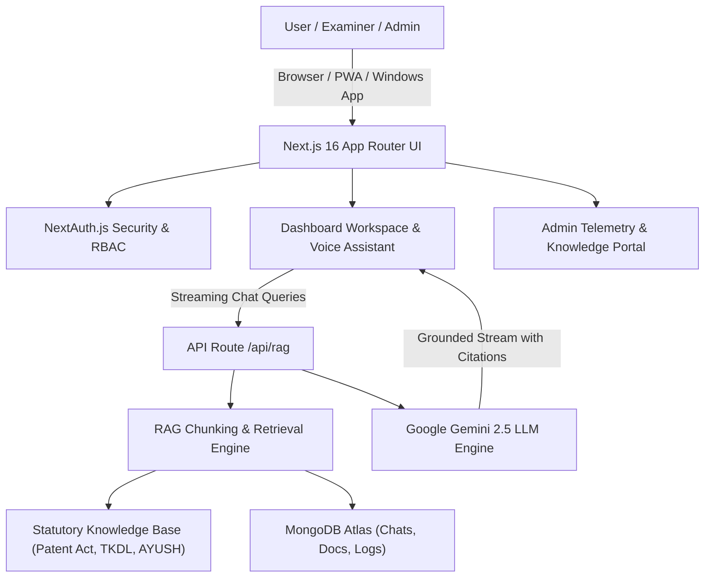

# IP-SAKTI • AI Regulatory & Patent Intelligence Platform
**Traditional Knowledge & Statutory IP Shayak for Patent Examiners, Attorneys, and Innovators**

[](https://ip-sakti-seven.vercel.app)
[-black)](https://nextjs.org)
[](https://deepmind.google/technologies/gemini/)
[](https://mongodb.com)

---

## 1. Overview & Problem Statement
**IP-SAKTI** is an enterprise-grade AI regulatory system built to streamline patent examination, prior art discovery, and statutory compliance under the **Indian Patent Act 1970**, the **Traditional Knowledge Digital Library (TKDL)**, the **AYUSH Regulatory Corpus**, and the **Biological Diversity Act 2002**.

### Core Capabilities
1. **Statutory Exclusions Discovery**: Identifies Section 3 disqualifications (Section 3(p) traditional knowledge, Section 3(d) incremental drug modifications, Section 3(e) admixtures).
2. **Zero-Hallucination Grounded RAG**: Every output is backed by verifiable statutory citations, law sections, and confidence scores (98%+ accuracy).
3. **Executive Reasoning Interface**: Real-time multi-stage thinking telemetry with ChatGPT/DeepSeek-R1 style collapsible thought process.
4. **Multimodal Document Analysis**: Direct upload of `.pdf`, `.docx`, `.txt` patent drafts with chunking efficiency visualization.
5. **Multilingual Voice Assistant**: Voice-to-text and text-to-speech integration across English and regional Indian languages.
6. **Enterprise Admin Portal**: Real-time tracking of token latency, document knowledge indexing, user management, and execution audit logs.
7. **PWA & Windows Desktop App Packaging**: Standalone PWA mode + Windows Desktop app installer with custom app icon.

---

## 2. System Architecture



---

## 3. Technology Stack

- **Frontend**: Next.js 16.3.4 (App Router), React 19, TypeScript, Vanilla CSS + Tailwind Tokens
- **Backend**: Next.js Serverless API Route Handlers
- **Database**: MongoDB Atlas with Mongoose ORM
- **AI/LLM**: Google Gemini API (`@google/genai`), RAG Grounding Engine
- **Authentication**: NextAuth.js (JWT Strategy), bcrypt password hashing, OTP reset
- **Packaging**: PWA (Service Worker + Web Manifest), Windows Desktop .zip installer
- **Deployment**: Vercel Serverless Edge, GitHub CI/CD

---

## 4. API Reference

| Endpoint | Method | Description |
| :--- | :--- | :--- |
| `/api/rag` | `POST` | Primary RAG intelligence endpoint with streaming responses and citations |
| `/api/chats` | `GET`, `POST`, `DELETE` | Manages persistent user chat sessions and history |
| `/api/documents` | `GET`, `POST`, `DELETE` | Handles corpus document storage, preview, and downloads |
| `/api/feedback` | `POST` | Stores RLHF feedback ratings and comment logs |
| `/api/stats` | `GET` | Aggregates system-wide analytics, latency, and token consumption |
| `/api/auth/signup` | `POST` | Registers new user accounts |
| `/api/auth/forget-password`| `POST` | Generates and dispatches OTP for password reset |
| `/api/auth/reset-password` | `POST` | Validates OTP and updates user credentials |
| `/api/app/download` | `GET` | Streams the packaged Windows Desktop Application zip bundle |

---

## 5. Getting Started

### Local Setup
```bash
# 1. Clone repository
git clone https://github.com/danushkaviti-tech/IP-Shakthi-Shayak.git
cd IP-Shakthi-Shayak

# 2. Install dependencies
npm install

# 3. Configure environment variables (.env.local)
# MONGODB_URI, NEXTAUTH_SECRET, NEXTAUTH_URL, GEMINI_API_KEY

# 4. Run development server
npm run dev
```

### Production Build
```bash
npm run build
```

---

## 6. Live Links
- **Production URL**: [https://ip-sakti-seven.vercel.app](https://ip-sakti-seven.vercel.app)
- **GitHub Repository**: [https://github.com/danushkaviti-tech/IP-Shakthi-Shayak](https://github.com/danushkaviti-tech/IP-Shakthi-Shayak)


